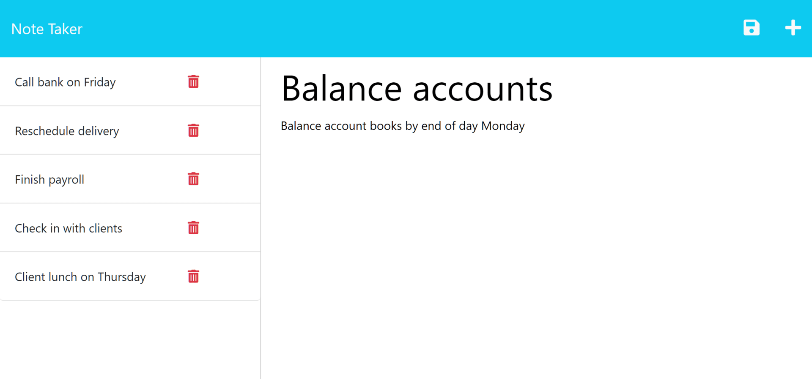

# Express.js: Note Taker

## Description
Use this application to write and save notes! Any created notes will remain until deleted. By building this application I was able to practice skills with setting up the back-end of an application.

## Installation
N/A

## Usage
To use this application, navigate to the link provided at the end of this section. After loading the landing page, click the "Let's Go" button to be brought to the main notes page. Here you will be able to create notes and save them to the site. To create a new note, click the + symbol in the top right corner, you will then be able to enter a note title and note text. To save, click the save icon button that appears next to the + icon after you type in a note title and text. You will be able to view all saved notes on this page. To delete a created note, click the little trash icon next to the note you want to delete. A couple images have been included to show the web application's appearance and functionality:  

Link to the deployed application: https://peaceful-taiga-23286-2c73ec1946f1.herokuapp.com/

## Credits
N/A

## License
Please refer to the license in the Git repo